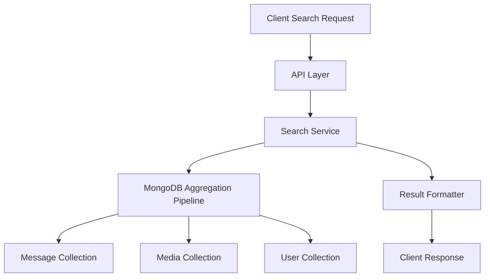

# Search Functionality Implementation Plan

## Overview

Building a comprehensive search system for messages, media, and users with advanced filtering options while optimizing for a self-hosted environment with minimal resources.

## Architecture Design

For a small deployment (20 users), we'll use MongoDB's native search capabilities rather than implementing a separate search engine like Elasticsearch. This simplifies the architecture while providing sufficient functionality.



## Implementation Components

### 1. Database Indexing Strategy

First, we need to create proper indexes to support efficient search:

```javascript
// MongoDB indexes for search performance
db.messages.createIndex({ content: "text" });
db.messages.createIndex({ conversationId: 1, createdAt: -1 });
db.messages.createIndex({ senderId: 1 });

db.media.createIndex({ "metadata.tags": 1 });
db.media.createIndex({ conversationId: 1, uploadedAt: -1 });
db.media.createIndex({ uploadedAt: 1 });
db.media.createIndex({ uploaderId: 1 });
db.media.createIndex({ mediaType: 1 });
db.media.createIndex({ "peopleTagged": 1 });

db.users.createIndex({ username: "text" });
db.users.createIndex({ email: "text" });
```

### 2. Search Service Implementation

```javascript
// search-service.js
const express = require('express');
const router = express.Router();
const { ObjectId } = require('mongodb');

// Generic search endpoint
router.get('/', async (req, res) => {
  try {
    const {
      query,
      type = 'all',
      conversationId,
      dateFrom,
      dateTo,
      peopleTagged,
      mediaType,
      senderId,
      limit = 20,
      offset = 0
    } = req.query;
    
    // Validate user has access to requested conversation
    if (conversationId) {
      const hasAccess = await checkConversationAccess(req.user.id, conversationId);
      if (!hasAccess) {
        return res.status(403).json({ error: 'Access denied to this conversation' });
      }
    }
    
    let results = {
      messages: [],
      media: [],
      users: []
    };
    
    // Convert date strings to Date objects if provided
    const dateFromObj = dateFrom ? new Date(dateFrom) : null;
    const dateToObj = dateTo ? new Date(dateTo) : null;
    
    // Determine which collections to search based on type
    const searchTypes = type === 'all' 
      ? ['messages', 'media', 'users'] 
      : [type];
    
    // Execute each search in parallel
    await Promise.all(searchTypes.map(async (searchType) => {
      switch (searchType) {
        case 'messages':
          results.messages = await searchMessages({
            query,
            conversationId,
            dateFrom: dateFromObj,
            dateTo: dateToObj,
            senderId,
            limit,
            offset
          }, req.user.id);
          break;
          
        case 'media':
          results.media = await searchMedia({
            query,
            conversationId,
            dateFrom: dateFromObj,
            dateTo: dateToObj,
            peopleTagged,
            mediaType,
            senderId,
            limit,
            offset
          }, req.user.id);
          break;
          
        case 'users':
          results.users = await searchUsers({
            query,
            limit,
            offset
          }, req.user.id);
          break;
      }
    }));
    
    // Format the combined results
    const formattedResults = formatSearchResults(results, type);
    
    return res.json(formattedResults);
    
  } catch (error) {
    console.error('Search error:', error);
    return res.status(500).json({ error: 'Search failed' });
  }
});

// Message search function
async function searchMessages(params, userId) {
  const {
    query,
    conversationId,
    dateFrom,
    dateTo,
    senderId,
    limit,
    offset
  } = params;
  
  // Build match criteria
  const matchCriteria = {};
  
  // Text search if query provided
  if (query && query.trim() !== '') {
    matchCriteria.$text = { $search: query };
  }
  
  // Filter by conversation
  if (conversationId) {
    matchCriteria.conversationId = conversationId;
  } else {
    // If no specific conversation, limit to conversations user has access to
    const userConversations = await ConversationModel.find(
      { participantIds: userId },
      { _id: 1 }
    );
    
    matchCriteria.conversationId = {
      $in: userConversations.map(c => c._id.toString())
    };
  }
  
  // Date range filter
  if (dateFrom || dateTo) {
    matchCriteria.createdAt = {};
    if (dateFrom) matchCriteria.createdAt.$gte = dateFrom;
    if (dateTo) matchCriteria.createdAt.$lte = dateTo;
  }
  
  // Sender filter
  if (senderId) {
    matchCriteria.senderId = senderId;
  }
  
  // Execute search
  const messages = await MessageModel.aggregate([
    { $match: matchCriteria },
    { $sort: { createdAt: -1 } },
    { $skip: parseInt(offset) },
    { $limit: parseInt(limit) },
    // Join with user info for sender details
    {
      $lookup: {
        from: 'users',
        localField: 'senderId',
        foreignField: '_id',
        as: 'sender'
      }
    },
    { $unwind: '$sender' },
    // Join with conversation info
    {
      $lookup: {
        from: 'conversations',
        localField: 'conversationId',
        foreignField: '_id',
        as: 'conversation'
      }
    },
    { $unwind: '$conversation' },
    // Project only needed fields
    {
      $project: {
        _id: 1,
        content: 1,
        mediaUrls: 1,
        createdAt: 1,
        sender: {
          _id: '$sender._id',
          username: '$sender.username',
          profilePicture: '$sender.profilePicture'
        },
        conversation: {
          _id: '$conversation._id',
          name: '$conversation.name'
        }
      }
    }
  ]);
  
  return messages;
}

// Media search function
async function searchMedia(params, userId) {
  const {
    query,
    conversationId,
    dateFrom,
    dateTo,
    peopleTagged,
    mediaType,
    senderId,
    limit,
    offset
  } = params;
  
  // Build match criteria
  const matchCriteria = {};
  
  // Filter by conversation
  if (conversationId) {
    matchCriteria.conversationId = conversationId;
  } else {
    // If no specific conversation, limit to conversations user has access to
    const userConversations = await ConversationModel.find(
      { participantIds: userId },
      { _id: 1 }
    );
    
    matchCriteria.conversationId = {
      $in: userConversations.map(c => c._id.toString())
    };
  }
  
  // Date range filter
  if (dateFrom || dateTo) {
    matchCriteria.uploadedAt = {};
    if (dateFrom) matchCriteria.uploadedAt.$gte = dateFrom;
    if (dateTo) matchCriteria.uploadedAt.$lte = dateTo;
  }
  
  // Media type filter
  if (mediaType) {
    matchCriteria.mediaType = mediaType;
  }
  
  // Uploader filter
  if (senderId) {
    matchCriteria.uploaderId = senderId;
  }
  
  // People tagged filter
  if (peopleTagged) {
    const taggedUsers = Array.isArray(peopleTagged) 
      ? peopleTagged 
      : [peopleTagged];
      
    matchCriteria.peopleTagged = { $all: taggedUsers };
  }
  
  // Tags/metadata search from query
  if (query && query.trim() !== '') {
    matchCriteria.$or = [
      { 'metadata.tags': { $regex: query, $options: 'i' } },
      { originalFilename: { $regex: query, $options: 'i' } }
    ];
  }
  
  // Execute search
  const media = await MediaModel.aggregate([
    { $match: matchCriteria },
    { $sort: { uploadedAt: -1 } },
    { $skip: parseInt(offset) },
    { $limit: parseInt(limit) },
    // Join with user info for uploader details
    {
      $lookup: {
        from: 'users',
        localField: 'uploaderId',
        foreignField: '_id',
        as: 'uploader'
      }
    },
    { $unwind: '$uploader' },
    // Join with conversation info
    {
      $lookup: {
        from: 'conversations',
        localField: 'conversationId',
        foreignField: '_id',
        as: 'conversation'
      }
    },
    { $unwind: '$conversation' },
    // Project only needed fields
    {
      $project: {
        _id: 1,
        mediaType: 1,
        thumbnailUrl: 1,
        previewUrl: 1,
        highResUrl: 1,
        uploadedAt: 1,
        peopleTagged: 1,
        uploader: {
          _id: '$uploader._id',
          username: '$uploader.username',
          profilePicture: '$uploader.profilePicture'
        },
        conversation: {
          _id: '$conversation._id',
          name: '$conversation.name'
        }
      }
    }
  ]);
  
  return media;
}

// User search function
async function searchUsers(params, currentUserId) {
  const { query, limit, offset } = params;
  
  // Build match criteria
  const matchCriteria = {};
  
  // Text search if query provided
  if (query && query.trim() !== '') {
    matchCriteria.$or = [
      { username: { $regex: query, $options: 'i' } },
      { email: { $regex: query, $options: 'i' } }
    ];
  }
  
  // Get conversations this user is part of
  const userConversations = await ConversationModel.find(
    { participantIds: currentUserId },
    { participantIds: 1 }
  );
  
  // Get all user IDs from these conversations
  const contactUserIds = new Set();
  userConversations.forEach(conv => {
    conv.participantIds.forEach(id => {
      if (id.toString() !== currentUserId.toString()) {
        contactUserIds.add(id.toString());
      }
    });
  });
  
  // Only return users the current user has conversations with
  matchCriteria._id = { $in: Array.from(contactUserIds).map(id => ObjectId(id)) };
  
  // Execute search
  const users = await UserModel.aggregate([
    { $match: matchCriteria },
    { $sort: { username: 1 } },
    { $skip: parseInt(offset) },
    { $limit: parseInt(limit) },
    // Project only needed fields
    {
      $project: {
        _id: 1,
        username: 1,
        email: 1,
        profilePicture: 1,
        lastActive: 1
      }
    }
  ]);
  
  return users;
}

// Format search results based on requested type
function formatSearchResults(results, type) {
  if (type !== 'all') {
    return {
      type,
      results: results[type + 's'], // Add 's' to make plural
      total: results[type + 's'].length,
      hasMore: results[type + 's'].length === parseInt(limit)
    };
  }
  
  return {
    messages: {
      results: results.messages,
      total: results.messages.length,
      hasMore: results.messages.length === parseInt(limit)
    },
    media: {
      results: results.media,
      total: results.media.length,
      hasMore: results.media.length === parseInt(limit)
    },
    users: {
      results: results.users,
      total: results.users.length,
      hasMore: results.users.length === parseInt(limit)
    }
  };
}

// Helper function to check user access to a conversation
async function checkConversationAccess(userId, conversationId) {
  const conversation = await ConversationModel.findById(conversationId);
  return conversation && conversation.participantIds.includes(userId);
}

module.exports = router;
```

### 3. Client-Side Search Interface

```javascript
// SearchScreen.js (React Native)
import React, { useState, useCallback } from 'react';
import { View, Text, TextInput, FlatList, TouchableOpacity, StyleSheet } from 'react-native';
import { useDispatch, useSelector } from 'react-redux';
import { searchContent } from '../redux/actions/searchActions';
import FastImage from 'react-native-fast-image';
import DateRangePicker from '../components/DateRangePicker';
import SegmentedControl from '../components/SegmentedControl';
import { debounce } from 'lodash';

const SearchScreen = ({ navigation }) => {
  const [query, setQuery] = useState('');
  const [searchType, setSearchType] = useState('all');
  const [dateRange, setDateRange] = useState({ from: null, to: null });
  const [mediaTypeFilter, setMediaTypeFilter] = useState('all');
  const [showFilters, setShowFilters] = useState(false);
  const [peopleTagFilter, setPeopleTagFilter] = useState([]);
  
  const dispatch = useDispatch();
  const searchResults = useSelector(state => state.search.results);
  const loading = useSelector(state => state.search.loading);
  const users = useSelector(state => state.users.users);
  
  // Debounced search function
  const debouncedSearch = useCallback(
    debounce((searchQuery, options) => {
      dispatch(searchContent(searchQuery, options));
    }, 500),
    []
  );
  
  // Handle search input change
  const handleSearchChange = (text) => {
    setQuery(text);
    
    const searchOptions = {
      type: searchType,
      dateFrom: dateRange.from,
      dateTo: dateRange.to,
      mediaType: mediaTypeFilter !== 'all' ? mediaTypeFilter : null,
      peopleTagged: peopleTagFilter.length > 0 ? peopleTagFilter : null
    };
    
    debouncedSearch(text, searchOptions);
  };
  
  // Change search type (all, messages, media, users)
  const handleTypeChange = (type) => {
    setSearchType(type);
    
    const searchOptions = {
      type,
      dateFrom: dateRange.from,
      dateTo: dateRange.to,
      mediaType: mediaTypeFilter !== 'all' ? mediaTypeFilter : null,
      peopleTagged: peopleTagFilter.length > 0 ? peopleTagFilter : null
    };
    
    debouncedSearch(query, searchOptions);
  };
  
  // Apply filters
  const applyFilters = () => {
    const searchOptions = {
      type: searchType,
      dateFrom: dateRange.from,
      dateTo: dateRange.to,
      mediaType: mediaTypeFilter !== 'all' ? mediaTypeFilter : null,
      peopleTagged: peopleTagFilter.length > 0 ? peopleTagFilter : null
    };
    
    dispatch(searchContent(query, searchOptions));
    setShowFilters(false);
  };
  
  // Render different types of search results
  const renderSearchResult = ({ item, index }) => {
    // Message result
    if (item.type === 'message') {
      return (
        <TouchableOpacity
          style={styles.messageResult}
          onPress={() => navigation.navigate('Conversation', { 
            id: item.conversation._id,
            messageId: item._id
          })}
        >
          <FastImage
            source={{ uri: item.sender.profilePicture }}
            style={styles.avatar}
          />
          <View style={styles.messageContent}>
            <Text style={styles.username}>{item.sender.username}</Text>
            <Text numberOfLines={2} style={styles.message}>{item.content}</Text>
            <Text style={styles.timestamp}>
              {new Date(item.createdAt).toLocaleDateString()} • 
              {item.conversation.name}
            </Text>
          </View>
        </TouchableOpacity>
      );
    }
    
    // Media result
    if (item.type === 'media') {
      return (
        <TouchableOpacity
          style={styles.mediaResult}
          onPress={() => navigation.navigate('MediaViewer', { mediaId: item._id })}
        >
          <FastImage
            source={{ uri: item.thumbnailUrl }}
            style={styles.mediaThumbnail}
            resizeMode={FastImage.resizeMode.cover}
          />
          <View style={styles.mediaInfo}>
            <Text style={styles.mediaUploader}>{item.uploader.username}</Text>
            <Text style={styles.mediaTimestamp}>
              {new Date(item.uploadedAt).toLocaleDateString()}
            </Text>
            <Text style={styles.mediaConversation}>{item.conversation.name}</Text>
          </View>
        </TouchableOpacity>
      );
    }
    
    // User result
    if (item.type === 'user') {
      return (
        <TouchableOpacity
          style={styles.userResult}
          onPress={() => navigation.navigate('Profile', { userId: item._id })}
        >
          <FastImage
            source={{ uri: item.profilePicture }}
            style={styles.userAvatar}
          />
          <View style={styles.userInfo}>
            <Text style={styles.username}>{item.username}</Text>
            <Text style={styles.userEmail}>{item.email}</Text>
          </View>
        </TouchableOpacity>
      );
    }
    
    return null;
  };
  
  return (
    <View style={styles.container}>
      <View style={styles.searchHeader}>
        <TextInput
          style={styles.searchInput}
          placeholder="Search messages, media, or people..."
          value={query}
          onChangeText={handleSearchChange}
          autoFocus
        />
        
        <TouchableOpacity
          style={styles.filterButton}
          onPress={() => setShowFilters(!showFilters)}
        >
          <Text>Filters</Text>
        </TouchableOpacity>
      </View>
      
      <SegmentedControl
        values={['All', 'Messages', 'Media', 'Users']}
        selectedIndex={['all', 'messages', 'media', 'users'].indexOf(searchType)}
        onChange={(index) => handleTypeChange(['all', 'messages', 'media', 'users'][index])}
        style={styles.segmentedControl}
      />
      
      {showFilters && (
        <View style={styles.filtersContainer}>
          <Text style={styles.filterTitle}>Date Range</Text>
          <DateRangePicker
            onChange={setDateRange}
            value={dateRange}
          />
          
          {(searchType === 'all' || searchType === 'media') && (
            <>
              <Text style={styles.filterTitle}>Media Type</Text>
              <SegmentedControl
                values={['All', 'Images', 'Videos']}
                selectedIndex={['all', 'image', 'video'].indexOf(mediaTypeFilter)}
                onChange={(index) => setMediaTypeFilter(['all', 'image', 'video'][index])}
              />
              
              <Text style={styles.filterTitle}>People Tagged</Text>
              <FlatList
                horizontal
                data={users}
                keyExtractor={item => item._id}
                renderItem={({ item }) => (
                  <TouchableOpacity
                    style={[
                      styles.personTag,
                      peopleTagFilter.includes(item._id) && styles.personTagSelected
                    ]}
                    onPress={() => {
                      if (peopleTagFilter.includes(item._id)) {
                        setPeopleTagFilter(peopleTagFilter.filter(id => id !== item._id));
                      } else {
                        setPeopleTagFilter([...peopleTagFilter, item._id]);
                      }
                    }}
                  >
                    <FastImage
                      source={{ uri: item.profilePicture }}
                      style={styles.personTagAvatar}
                    />
                    <Text style={styles.personTagName}>{item.username}</Text>
                  </TouchableOpacity>
                )}
              />
            </>
          )}
          
          <TouchableOpacity
            style={styles.applyButton}
            onPress={applyFilters}
          >
            <Text style={styles.applyButtonText}>Apply Filters</Text>
          </TouchableOpacity>
        </View>
      )}
      
      <FlatList
        data={
          searchResults.messages?.map(item => ({ ...item, type: 'message' }))
            .concat(searchResults.media?.map(item => ({ ...item, type: 'media' })))
            .concat(searchResults.users?.map(item => ({ ...item, type: 'user' })))
            .sort((a, b) => {
              const dateA = a.createdAt || a.uploadedAt || a.lastActive;
              const dateB = b.createdAt || b.uploadedAt || b.lastActive;
              return new Date(dateB) - new Date(dateA);
            })
        }
        renderItem={renderSearchResult}
        keyExtractor={item => `${item.type}-${item._id}`}
        ListEmptyComponent={
          <View style={styles.emptyContainer}>
            <Text style={styles.emptyText}>
              {loading ? 'Searching...' : query ? 'No results found' : 'Search for messages, media, or people'}
            </Text>
          </View>
        }
      />
    </View>
  );
};

const styles = StyleSheet.create({
  container: {
    flex: 1,
    backgroundColor: '#fff',
  },
  searchHeader: {
    flexDirection: 'row',
    padding: 10,
    borderBottomWidth: 1,
    borderBottomColor: '#eee',
  },
  searchInput: {
    flex: 1,
    height: 40,
    borderWidth: 1,
    borderColor: '#ddd',
    borderRadius: 20,
    paddingHorizontal: 15,
    marginRight: 10,
  },
  filterButton: {
    justifyContent: 'center',
    alignItems: 'center',
    paddingHorizontal: 10,
  },
  segmentedControl: {
    margin: 10,
  },
  filtersContainer: {
    padding: 10,
    borderBottomWidth: 1,
    borderBottomColor: '#eee',
  },
  filterTitle: {
    fontWeight: 'bold',
    marginVertical: 5,
  },
  applyButton: {
    backgroundColor: '#007AFF',
    padding: 10,
    borderRadius: 5,
    alignItems: 'center',
    marginTop: 10,
  },
  applyButtonText: {
    color: 'white',
    fontWeight: 'bold',
  },
  // Message result styles
  messageResult: {
    flexDirection: 'row',
    padding: 10,
    borderBottomWidth: 1,
    borderBottomColor: '#eee',
  },
  avatar: {
    width: 50,
    height: 50,
    borderRadius: 25,
    marginRight: 10,
  },
  messageContent: {
    flex: 1,
  },
  username: {
    fontWeight: 'bold',
  },
  message: {
    color: '#333',
  },
  timestamp: {
    fontSize: 12,
    color: '#999',
    marginTop: 5,
  },
  // Media result styles
  mediaResult: {
    flexDirection: 'row',
    padding: 10,
    borderBottomWidth: 1,
    borderBottomColor: '#eee',
  },
  mediaThumbnail: {
    width: 80,
    height: 80,
    borderRadius: 5,
    marginRight: 10,
  },
  mediaInfo: {
    flex: 1,
    justifyContent: 'center',
  },
  mediaUploader: {
    fontWeight: 'bold',
  },
  mediaTimestamp: {
    fontSize: 12,
    color: '#999',
  },
  mediaConversation: {
    fontSize: 12,
    color: '#666',
    marginTop: 5,
  },
  // User result styles
  userResult: {
    flexDirection: 'row',
    padding: 10,
    borderBottomWidth: 1,
    borderBottomColor: '#eee',
  },
  userAvatar: {
    width: 50,
    height: 50,
    borderRadius: 25,
    marginRight: 10,
  },
  userInfo: {
    flex: 1,
    justifyContent: 'center',
  },
  userEmail: {
    color: '#666',
  },
  // People tag filter styles
  personTag: {
    flexDirection: 'row',
    alignItems: 'center',
    backgroundColor: '#f0f0f0',
    borderRadius: 20,
    padding: 5,
    marginRight: 10,
  },
  personTagSelected: {
    backgroundColor: '#e0f0ff',
    borderWidth: 1,
    borderColor: '#007AFF',
  },
  personTagAvatar: {
    width: 30,
    height: 30,
    borderRadius: 15,
    marginRight: 5,
  },
  personTagName: {
    marginRight: 5,
  },
  // Empty state
  emptyContainer: {
    flex: 1,
    justifyContent: 'center',
    alignItems: 'center',
    padding: 20,
    height: 200,
  },
  emptyText: {
    color: '#999',
    textAlign: 'center',
  },
});

export default SearchScreen;
```

### 4. AI-Enhanced Search Functionality

For AI-based search, we'll implement a simple yet effective system using text classification and image analysis:

```javascript
// ai-search-service.js (Node.js)
const express = require('express');
const router = express.Router();
const vision = require('@tensorflow/tfjs-node');
const mobilenet = require('@tensorflow-models/mobilenet');
const jimp = require('jimp');

// Load models
let imageClassifier = null;

async function loadModels() {
  try {
    imageClassifier = await mobilenet.load();
    console.log('AI models loaded successfully');
  } catch (error) {
    console.error('Error loading AI models:', error);
  }
}

// Load models at startup
loadModels();

// AI search endpoint
router.get('/ai-search', async (req, res) => {
  try {
    const {
      query,
      conversationId,
      dateFrom,
      dateTo,
      limit = 20,
      offset = 0
    } = req.query;
    
    // Validate user has access to requested conversation
    if (conversationId) {
      const hasAccess = await checkConversationAccess(req.user.id, conversationId);
      if (!hasAccess) {
        return res.status(403).json({ error: 'Access denied to this conversation' });
      }
    }
    
    // Extract potential search concepts from query
    const concepts = extractConcepts(query);
    
    // Search for photos matching concepts
    const matchingMedia = await searchMediaByConcepts(
      concepts,
      {
        conversationId,
        dateFrom: dateFrom ? new Date(dateFrom) : null,
        dateTo: dateTo ? new Date(dateTo) : null,
        limit,
        offset
      },
      req.user.id
    );
    
    return res.json({
      query,
      concepts,
      results: matchingMedia
    });
    
  } catch (error) {
    console.error('AI search error:', error);
    return res.status(500).json({ error: 'AI search failed' });
  }
});

// Extract concepts from natural language query
function extractConcepts(query) {
  // This is a simplified version
  // In a production app, you could use NLP libraries like compromise or natural
  
  const concepts = [];
  
  // Common concepts to search for
  const conceptKeywords = {
    'person': ['person', 'people', 'human', 'face', 'man', 'woman', 'child', 'boy', 'girl'],
    'group': ['group', 'team', 'crowd', 'party', 'gathering', 'meeting'],
    'outdoor': ['outdoor', 'outside', 'nature', 'landscape', 'scenery', 'beach', 'mountain', 'park', 'garden'],
    'food': ['food', 'meal', 'lunch', 'dinner', 'breakfast', 'restaurant', 'cooking', 'dish', 'plate'],
    'pet': ['pet', 'dog', 'cat', 'animal'],
    'text': ['text', 'document', 'note', 'writing'],
    'vehicle': ['car', 'vehicle', 'bike', 'motorcycle', 'bus', 'train'],
    'building': ['building', 'architecture', 'house', 'apartment', 'office'],
    'selfie': ['selfie'],
    'screenshot': ['screenshot', 'screen'],
  };
  
  // Check if query contains any concept keywords
  const lowerQuery = query.toLowerCase();
  for (const [concept, keywords] of Object.entries(conceptKeywords)) {
    for (const keyword of keywords) {
      if (lowerQuery.includes(keyword)) {
        concepts.push(concept);
        break;
      }
    }
  }
  
  return concepts;
}

// Search media by concepts
async function searchMediaByConcepts(concepts, params, userId) {
  const {
    conversationId,
    dateFrom,
    dateTo,
    limit,
    offset
  } = params;
  
  // Build match criteria
  const matchCriteria = {};
  
  // Filter by conversation
  if (conversationId) {
    matchCriteria.conversationId = conversationId;
  } else {
    // If no specific conversation, limit to conversations user has access to
    const userConversations = await ConversationModel.find(
      { participantIds: userId },
      { _id: 1 }
    );
    
    matchCriteria.conversationId = {
      $in: userConversations.map(c => c._id.toString())
    };
  }
  
  // Date range filter
  if (dateFrom || dateTo) {
    matchCriteria.uploadedAt = {};
    if (dateFrom) matchCriteria.uploadedAt.$gte = dateFrom;
    if (dateTo) matchCriteria.uploadedAt.$lte = dateTo;
  }
  
  // Limit to images (not videos)
  matchCriteria.mediaType = 'image';
  
  // Filter by AI-generated tags if available
  if (concepts.length > 0) {
    matchCriteria['metadata.aiTags'] = { $in: concepts };
  }
  
  // Execute search
  const media = await MediaModel.aggregate([
    { $match: matchCriteria },
    { $sort: { uploadedAt: -1 } },
    { $skip: parseInt(offset) },
    { $limit: parseInt(limit) },
    // Join with user info for uploader details
    {
      $lookup: {
        from: 'users',
        localField: 'uploaderId',
        foreignField: '_id',
        as: 'uploader'
      }
    },
    { $unwind: '$uploader' },
    // Join with conversation info
    {
      $lookup: {
        from: 'conversations',
        localField: 'conversationId',
        foreignField: '_id',
        as: 'conversation'
      }
    },
    { $unwind: '$conversation' },
    // Project only needed fields
    {
      $project: {
        _id: 1,
        mediaType: 1,
        thumbnailUrl: 1,
        previewUrl: 1,
        highResUrl: 1,
        uploadedAt: 1,
        metadata: 1,
        uploader: {
          _id: '$uploader._id',
          username: '$uploader.username',
          profilePicture: '$uploader.profilePicture'
        },
        conversation: {
          _id: '$conversation._id',
          name: '$conversation.name'
        }
      }
    }
  ]);
  
  return media;
}

// Media analysis function - called during media processing to generate AI tags
async function analyzeImage(imagePath) {
  try {
    if (!imageClassifier) {
      await loadModels();
    }
    
    // Load image
    const image = await jimp.read(imagePath);
    const tensor = vision.node.decodeImage(await image.getBufferAsync(jimp.MIME_JPEG));
    
    // Run classification
    const predictions = await imageClassifier.classify(tensor);
    
    // Generate tags from predictions
    const tags = predictions
      .filter(p => p.probability > 0.5)
      .map(p => p.className.split(',')[0].trim().toLowerCase());
    
    // Map to general concepts
    const concepts = [];
    
    // Common concept mappings
    const conceptMappings = {
      'person': ['person', 'people', 'face', 'man', 'woman', 'child', 'boy', 'girl', 'human'],
      'group': ['group', 'people'],
      'outdoor': ['outdoor', 'nature', 'landscape', 'sky', 'beach', 'mountain', 'tree', 'plant', 'forest', 'grass', 'water'],
      'food': ['food', 'fruit', 'vegetable', 'meat', 'dish', 'meal', 'snack', 'dessert'],
      'pet': ['dog', 'cat', 'pet', 'animal', 'bird'],
      'text': ['text', 'document', 'book', 'paper'],
      'vehicle': ['car', 'vehicle', 'bicycle', 'motorcycle', 'bus', 'train', 'truck', 'boat'],
      'building': ['building', 'house', 'architecture', 'tower', 'castle', 'skyscraper'],
    };
    
    // Map tags to concepts
    for (const [concept, keywords] of Object.entries(conceptMappings)) {
      for (const tag of tags) {
        if (keywords.some(keyword => tag.includes(keyword))) {
          concepts.push(concept);
          break;
        }
      }
    }
    
    // Return unique concepts
    return [...new Set(concepts)];
    
  } catch (error) {
    console.error('Image analysis error:', error);
    return [];
  }
}

module.exports = {
  router,
  analyzeImage
};
```

### 5. Media Processing Integration for Search

Update the media processing pipeline to generate tags for search:

```javascript
// Update to media-processor.js
const { analyzeImage } = require('./ai-search-service');

// Inside processImage function
async function processImage(filePath, outputDir, mediaId) {
  const image = sharp(filePath);
  const metadata = await image.metadata();
  
  // Process image variants
  const variants = [/* ... existing code ... */];
  
  // Generate AI tags for searchability
  const aiTags = await analyzeImage(filePath);
  
  // Return result with AI tags
  return {
    variants,
    metadata: {
      width: metadata.width,
      height: metadata.height,
      format: metadata.format,
      aiTags
    }
  };
}
```

## Search Optimization for Self-Hosting

For a small deployment (20 users), these optimizations make search efficient:

1. **Database Indexing Strategy:**
   - Create specific indexes only for fields used in search
   - Use compound indexes for common query patterns
   - Add TTL index for search history to auto-clean

2. **Query Optimization:**
   - Implement pagination with reasonable limits (20 items per page)
   - Use projection to return only needed fields
   - Cache frequent searches with Redis (5-minute TTL)

3. **Resource Management:**
   - Run AI processing as a background job during upload, not during search
   - Schedule intensive indexing during off-peak hours
   - Implement rate limiting for search requests (max 10 requests per minute per user)

4. **Performance Monitoring:**
   - Add query execution time logging
   - Set up alerts for slow queries
   - Periodically review and optimize search patterns
